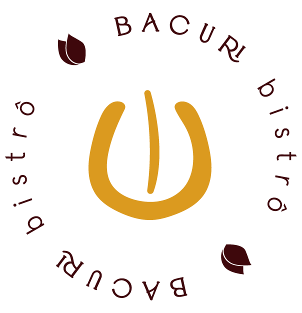
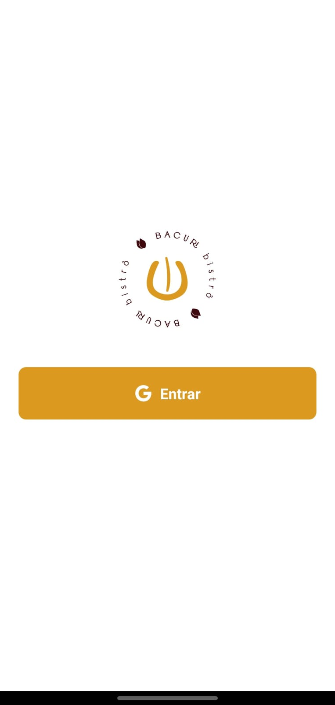
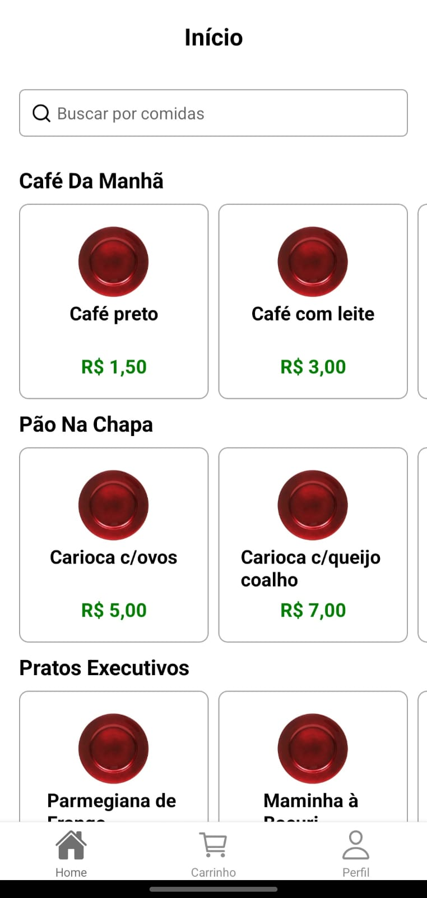
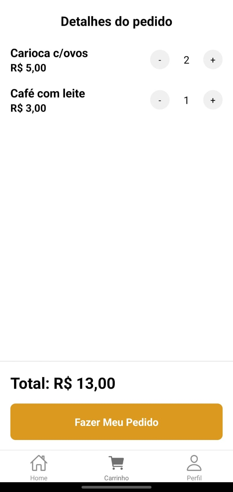

# Bacuri App



Este é um aplicativo de pedidos para o bacuri bistro, desenvolvido com **Expo**. Ele permite que os usuários façam login social usando sua conta do Google, visualizem produtos do restaurante organizados por categoria, adicionem itens ao carrinho e finalizem o pedido diretamente no WhatsApp do restaurante.

## Funcionalidades

- **Login Social com Google:** Os usuários podem se autenticar utilizando o login social do Google.



- **Visualização de Produtos:** Ao entrar no app, o usuário vê os produtos do restaurante organizados por categoria (ex: café da manhã, pratos executivos, sobremesas).



- **Carrinho de Compras:** O usuário pode adicionar produtos ao carrinho, onde é possível:
  - Aumentar a quantidade de itens.
  - Visualizar detalhes como quantidade, nome do produto, preço individual e total da compra.
- **Finalização do Pedido:** Ao clicar no botão "Finalizar Pedido", o usuário é redirecionado para o WhatsApp do restaurante com a lista dos itens e quantidades para realizar o pedido.



## Tecnologias Utilizadas

- **React Native** com **Expo**: Framework para construir o aplicativo.
- **Expo Google Authentication**: Implementação do login social com Google.
- **React Context API**: Utilizado para gerenciar o estado global do carrinho de compras.
- **WhatsApp API**: Integração para redirecionar os pedidos ao WhatsApp do restaurante.
- **TypeScript**: Linguagem usada para garantir tipagem estática e segurança no código.

## Instalação

1. Clone o repositório:
   ```bash
   git clone https://github.com/usuario/restaurante-app.git
   ```

2. Navegue até a pasta do projeto:
   ```bash
   cd restaurante-app
   ```

3. Instale as dependências:
   ```bash
   npm install
   ```

4. Execute o projeto:
   ```bash
   expo start
   ```

## Exemplo de Pedido no WhatsApp

Ao finalizar o pedido, o usuário será redirecionado para o WhatsApp do restaurante com uma mensagem pré-formatada contendo o resumo do pedido:
```
Olá, gostaria de fazer o seguinte pedido:
1x Prato Executivo - R$ 25,00
2x Sobremesa - R$ 10,00
Total: R$ 35,00
```

## Contribuição

1. Faça um fork do repositório.
2. Crie uma nova branch para suas modificações (`git checkout -b feature/nome-da-feature`).
3. Faça o commit das suas alterações (`git commit -m 'Adiciona nova funcionalidade'`).
4. Envie para o repositório remoto (`git push origin feature/nome-da-feature`).
5. Abra um Pull Request.

## Licença

Este projeto está licenciado sob a Licença MIT - consulte o arquivo [LICENSE](LICENSE) para mais detalhes.

---

[](https://www.linkedin.com/in/guerreiru/) 
[](mailto:dev.fernandoguerreiro@gmail.com)
